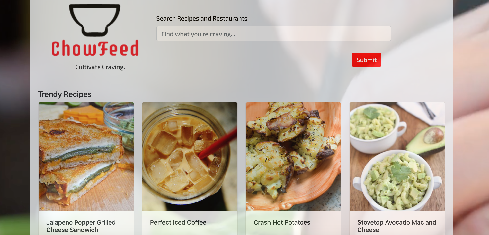

# ChowFeed

## Overview
ChowFeed is an application that allows you to search for recipes and nearby restaurants recommendations at the same time.

## Usage
ChowFeed is deployed on GitHub Pages. User must go to https://saronnhong.github.io/ChowFeed/ to view the app. The app will initially load a list of trendy restaurants and recipes. User is then able to do a search for type of recipes and restaurants that they are interested in. The app gets results from the Food2Fork API and the Yelp Fusion API to get results in the San Diego area. User is also able to select next to see more results from their searches. The app uses Local Storage to keep the search results without having to make another API request to see more results. 

## Examples
### Images:

Screenshot

## Technologies
The Mongo Scraper app was created using these technologies
* JavaScipt
* CSS
* JQuery
* Local Storage
* Firebase
* Yelp Fusion API
* Food2Fork API

## DEPLOYED WEBSITE
[GH Pages link](https://saronnhong.github.io/ChowFeed/)

## GITHUB
[Github link](https://github.com/saronnhong/ChowFeed)

 